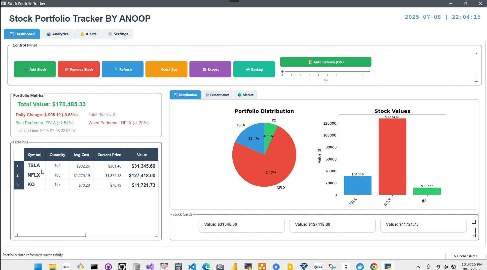
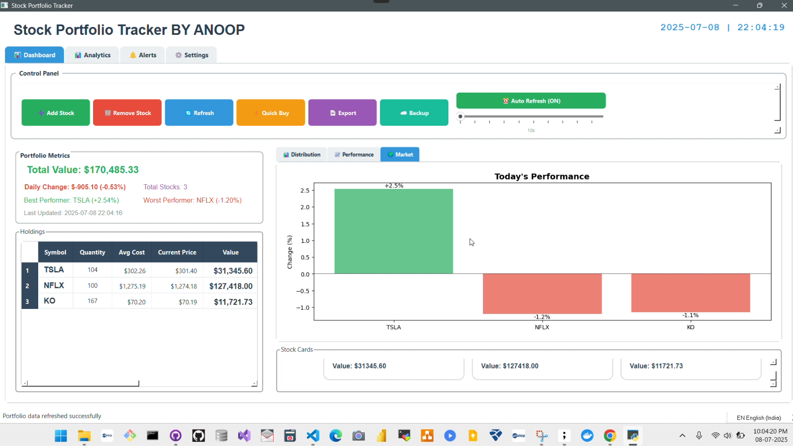
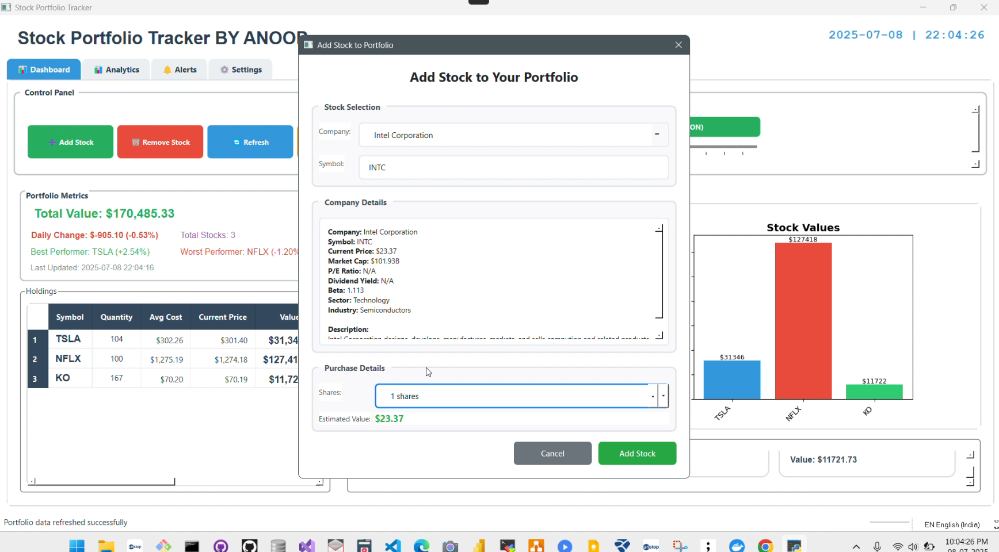
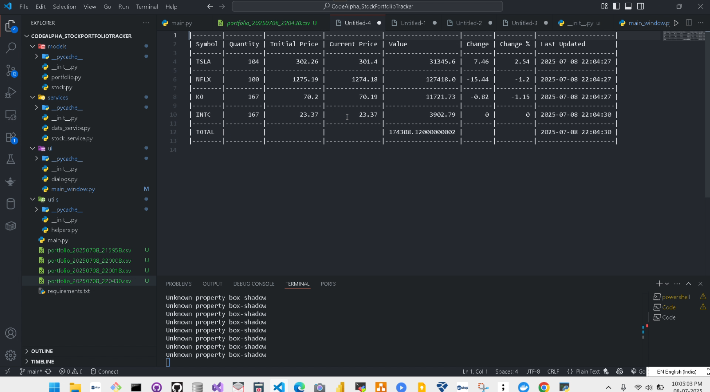
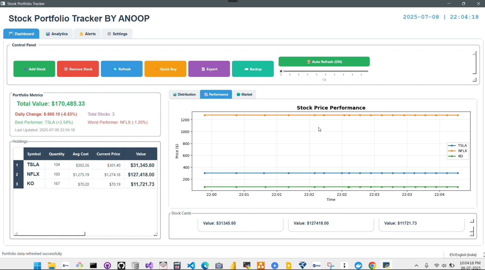

# 📊 Live Stock Portfolio Tracker (Prototype)

### 🔧 Built with Python + PyQt6 + yfinance + matplotlib

> 🏗️ Internship Project @ [CodeAlpha](https://www.linkedin.com/company/codealpha/)
> 👨‍💻 Developed by: Anoop Kumar Yadav

---

## 🧠 Overview

This is a **desktop-based prototype application** that allows users to track their stock portfolio in real time. It was built as part of my **Python Programming Internship at CodeAlpha**.

The app provides a clean GUI where users can input stock symbols and quantities, fetch **live stock prices** via the `yfinance` API, and visualize their total investment using a **bar chart powered by `matplotlib`**.

---

## 🚀 Features

* ✅ GUI built with **PyQt6**
* ✅ Input multiple stock symbols and quantities
* ✅ Fetch **live prices** using `yfinance`
* ✅ Calculate and display **total investment**
* ✅ Render stock-wise value using **matplotlib bar chart**
* ✅ Save the full report to a **CSV file** for offline use

---

## 📸 Screenshots

> 
> 
> 
> 
> 
> 

---

## 📦 Installation

1. 🔽 **Clone this repo**

```bash
git clone https://github.com/<your-username>/stock-portfolio-tracker.git
cd stock-portfolio-tracker
```

2. 📦 **Install dependencies**

```bash
pip install PyQt6 matplotlib yfinance
```

---

## ▶️ Run the App

```bash
python main.py
```

The PyQt6 GUI will open.
Enter stock symbols (like AAPL, TSLA, GOOGL) and their quantities to see the total investment and a bar chart.

---

## 🚰 Tech Stack

| Tool           | Purpose                   |
| -------------- | ------------------------- |
| **Python**     | Core programming language |
| **PyQt6**      | GUI creation              |
| **yfinance**   | Live stock price data     |
| **matplotlib** | Investment charting       |
| **CSV Module** | Report export             |

---

## 🗓️ Current Status

🧪 **Prototype Completed**
🔄 **Planned Enhancements**:

* User authentication system
* Dynamic stock symbol search
* Historical performance visualization
* Export to Excel and PDF

---

## 🧑‍💼 Developer

**Anoop Kumar Yadav**
📍 Python Programming Intern @ CodeAlpha
📧 anoop9569110314@gmail.com | 🌐 https://www.linkedin.com/in/anoop-kumar-yadav-9b31b3283/

---

## 📜 License

This project is licensed for educational and personal use only as part of an internship project.
